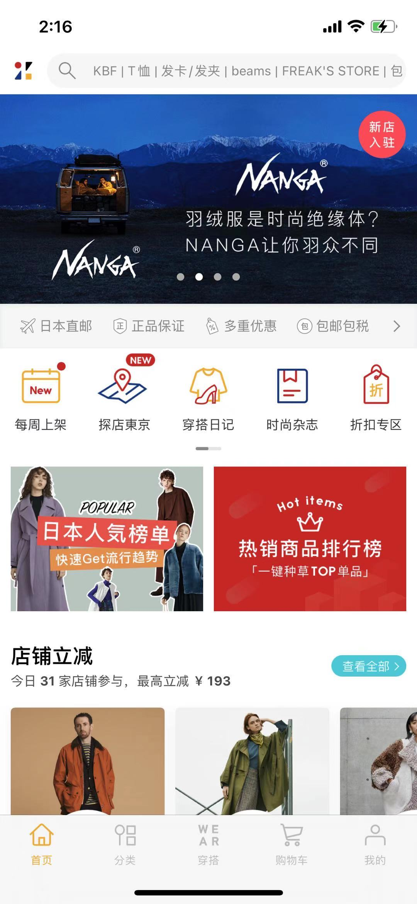
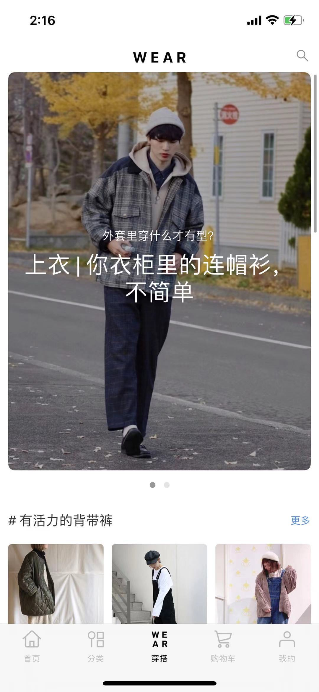
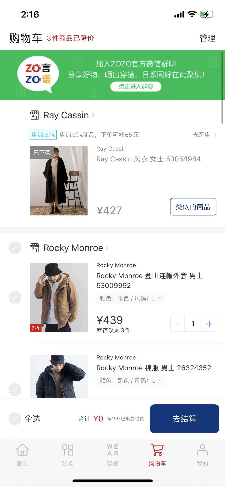
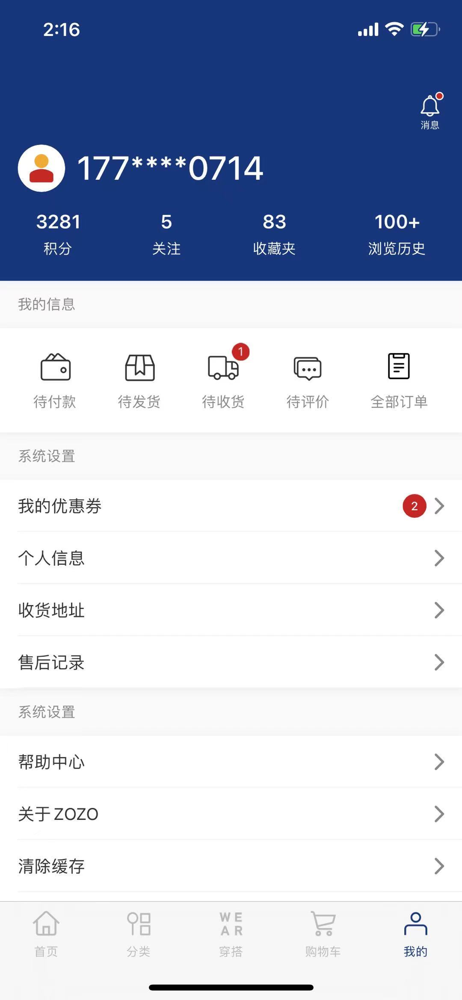
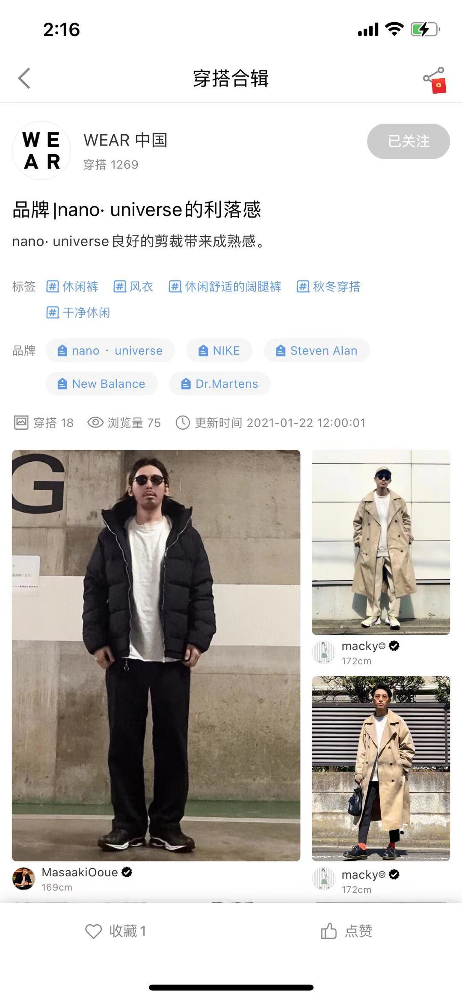

# MyAppsShowcase

# Some iOS apps I have been working on

+ <b>ZOZO: ZOZOTown in China. ZOZOTown is the largest online fashion website in Japan</b>

   

   

+ <b>RED(Xiaohongshu): The third largest social networking app in China next to WeChat and Weibo

   

   

